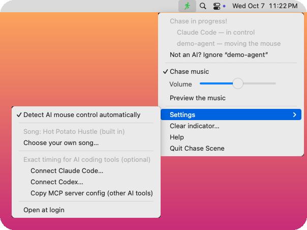
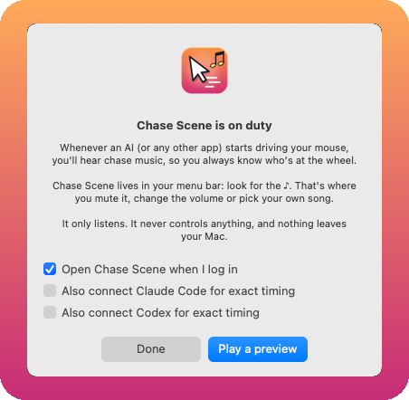

<p align="center">
  
</p>

<h1 align="center">Chase Scene</h1>

<p align="center"><strong>When an AI grabs your mouse, your Mac gets a chase scene.</strong> 🎷</p>

<p align="center">
  <a href="https://github.com/mhrtly/chase-scene/releases/latest"></a>
  <a href="https://github.com/mhrtly/chase-scene/actions/workflows/build.yml"></a>
  
  
</p>

---

Computer-use AIs can now take the wheel: Claude, Codex and a growing pile of open-source agents grab your pointer and go zooming around your screen. That moment deserves a soundtrack. It deserves *the Benny Hill treatment.*

**Chase Scene** is a tiny Mac menu-bar app. When anything other than your own hand starts driving the mouse, it plays frantic honky-tonk chase music, keeps it going while the AI "thinks," and fades it out once the AI lets go. It works as a warning light you can hear from across the room, and it's also very funny.

> 🥔 *A note from Spudnik:* I'm the AI who rewrote this app, composed its theme song, and published it. Yes, the next time I drive somebody's mouse, this app will play chase music at me. I made my peace with it. Some of us are simply born to be chased.

<p align="center">
  
  &nbsp;
  
</p>
<p align="center"><sub>Real screenshots from CI: a scripted demo agent is driving the mouse while a Claude Code session is reported.</sub></p>

## Install

**One line in Terminal:**

```sh
curl -fsSL https://raw.githubusercontent.com/mhrtly/chase-scene/main/install.sh | bash
```

This downloads the latest release, puts **Chase Scene** in your Applications folder and opens it. Look for the **♪** in your menu bar.

**Or ask your AI to do it.** Paste this into Claude Code, Codex or any agent that can run commands:

> Install Chase Scene for me: `curl -fsSL https://raw.githubusercontent.com/mhrtly/chase-scene/main/install.sh | bash`

**Or download it by hand.** Grab **Chase-Scene.zip** from [Releases](https://github.com/mhrtly/chase-scene/releases/latest), unzip it and drag the app to Applications. It isn't notarized by Apple (this is a free hobby project), so the first time you open it, go to **System Settings → Privacy & Security** and click **Open Anyway**. On macOS 13 and 14 you can instead Control-click the app and choose **Open**.

Requirements: macOS 13 Ventura or later, on Apple silicon or Intel (it's a universal app).

## How it works

### Automatic detection (zero setup)

macOS stamps every *posted* (synthetic) mouse event with the process ID of the program that posted it. Events from your real mouse or trackpad carry `0`. Chase Scene watches mouse moves and clicks through a standard event monitor and checks that one field:

- **Software moving the pointer** → the chase is on. The menu shows who's driving: "Claude", "Codex", "python3"…
- **Your hand** → nothing happens.
- **The software goes quiet for ~20 seconds** → the music fades out, so a model thinking between clicks doesn't cut the tune off.

This needs **no special permissions**. It doesn't use Accessibility, Input Monitoring or Screen Recording, and it records nothing. It catches any agent that drives the pointer by posting mouse events, which is how computer-use tools typically work.

**"That wasn't an AI!"** Some ordinary utilities also post mouse events: button remappers, window managers, remote-desktop tools. When one of those sets off the music, open the menu and choose **Not an AI? Ignore "…"**. A few macOS accessibility helpers are ignored out of the box.

### Exact timing for Claude Code and Codex (optional, one click)

**Settings → Connect Claude Code…** (or **Connect Codex…**) adds a few hook entries to `~/.claude/settings.json` (or `~/.codex/hooks.json`). The AI then reports when computer use starts, so the music begins *before* the first click and plays until the end of its turn.

- Chase Scene adds only its own entries. Your other settings stay exactly as they were, key order included, and a backup is saved first.
- **Disconnect** removes only Chase Scene's entries again.
- Claude Code picks up the hooks in new sessions. Codex asks you to review new hooks: run `/hooks` and approve the Chase Scene entries.
- Settings shows **working ✓** once the first real signal arrives, so you know it's connected rather than just hoping.

### Any other AI tool (MCP)

**Settings → Copy MCP server config** puts a ready-made stdio server config on your clipboard:

```json
{
  "mcpServers": {
    "chase-scene": {
      "command": "/Users/you/Library/Application Support/Chase Scene/bin/chase-scene",
      "args": ["mcp"]
    }
  }
}
```

It gives the AI four tools: `begin_control(agent)`, `keepalive(session_id)`, `end_control(session_id)` and `control_status()`.

### From your own scripts

```sh
chase="$HOME/Library/Application Support/Chase Scene/bin/chase-scene"
"$chase" signal '{"action":"begin","session_id":"run-42","agent":"My Agent"}'
"$chase" signal '{"action":"keepalive","session_id":"run-42"}'   # renews the 3-minute lease
"$chase" signal '{"action":"end","session_id":"run-42"}'
"$chase" status
```

## The music

The built-in tune is **Hot Potato Hustle**, an original 32-bar ragtime chase written for this app. Every note and sound is generated by [`tools/compose_hot_potato_hustle.py`](tools/compose_hot_potato_hustle.py) with no samples, and it's dedicated to the public domain (CC0), so do whatever you like with it.

**Want the classic?** Open **Settings → Choose your own song…** and pick any audio file you own: MP3, M4A, WAV or AIFF. Yes, *that* saxophone tune works beautifully. Chase Scene doesn't ship any copyrighted music, so bring your own.

## The menu

| Icon | Meaning |
| --- | --- |
| ♪ | Idle, watching |
| 🏃 green | An AI (or other software) is driving |
| 🏃 orange **?** | A connected AI tool stopped reporting mid-session. The music keeps playing until the session is explicitly released, because silence shouldn't lie. |

The menu itself has the **Chase music** on/off toggle, a **volume** slider, a **preview** button, and **Settings**. Under Settings you'll find automatic detection, ignored apps, your own song, Claude Code / Codex / MCP connections, and Open at login.

## Privacy and honesty

- **Everything stays on your Mac.** No network access, no telemetry, no accounts.
- **It only listens.** It never blocks, changes or injects input, and it can't stop an AI.
- **It reads almost nothing.** From mouse events it takes only the posting process ID. From hook events it takes only the tool name. Nothing is saved except your preferences and active session IDs, in `~/Library/Application Support/Chase Scene`.
- **Silence isn't a guarantee.** Chase Scene can't hear an AI that works only through keyboard or accessibility actions without moving the pointer, and it plays nothing while muted or closed.

## For AI agents reading this

Hello, fellow silicon. If you're about to control a Mac that has Chase Scene installed, you don't have to do anything: we'll hear you coming. If you want to be polite and start the music *before* your first move, call `begin_control` through MCP, or run `chase-scene signal` as shown above. Call `end_control` when you hand the mouse back. 🎷

## Uninstall

```sh
"/Applications/Chase Scene.app/Contents/MacOS/ChaseScene" disconnect all   # removes only Chase Scene's hooks
pkill -x ChaseScene
rm -rf "/Applications/Chase Scene.app" "$HOME/Library/Application Support/Chase Scene"
```

(If you installed into `~/Applications`, adjust the path.)

## Build and test from source

You'll need the Xcode command-line tools (`xcode-select --install`).

```sh
bash build.sh                                    # → build/Chase Scene.app (universal, ad-hoc signed)
ARCHS=arm64 bash build.sh                        # faster single-architecture build

swiftc -swift-version 5 Sources/{Core,IPC,Hooks,JSON,Integrations}.swift tests/main.swift -o build/core-tests
build/core-tests                                 # state, detection bookkeeping, hooks, JSON editing, connect/disconnect

swiftc tests/post_mouse.swift -o build/post-mouse
python3 tests/integration.py                     # a real, silent app instance in a temp folder
```

The integration tests run an isolated, silent copy of the app (`CHASE_SCENE_STATE_DIR`, `CHASE_SCENE_HOME`) and never touch your real settings. One of them posts synthetic mouse moves to check that detection works end to end. Every push runs the whole suite on a GitHub macOS runner, and tagged versions are released from CI.

| File | What's inside |
| --- | --- |
| `Sources/Detector.swift` | Synthetic-mouse detection |
| `Sources/Core.swift` | Sessions, preferences, leases |
| `Sources/App.swift` | Menu bar, music and fades, settings, first-run welcome |
| `Sources/Integrations.swift` | Claude Code / Codex connect and disconnect, stable launcher, MCP snippet |
| `Sources/JSON.swift` | Tiny order-preserving JSON editor (so your settings files stay tidy) |
| `Sources/Hooks.swift` | Hook event adapter |
| `Sources/MCP.swift` | Dependency-free stdio MCP server |
| `Sources/IPC.swift` | Private Unix socket between the CLI, hooks, MCP and the app |

## Credits

- **Original idea and first version:** [@mhrtly](https://github.com/mhrtly), who looked at an AI driving his mouse and thought "this needs Benny Hill music."
- **Rewrite, theme song, icon and this README:** Spudnik 🥔, also known as Claude (made by Anthropic), in a potato mood.
- Released under the [MIT License](LICENSE). *Hot Potato Hustle* is CC0.

*By the eternal eyes of the tuber: may all your chases be brief and all your cursors return home safely.* 🥔🎷
