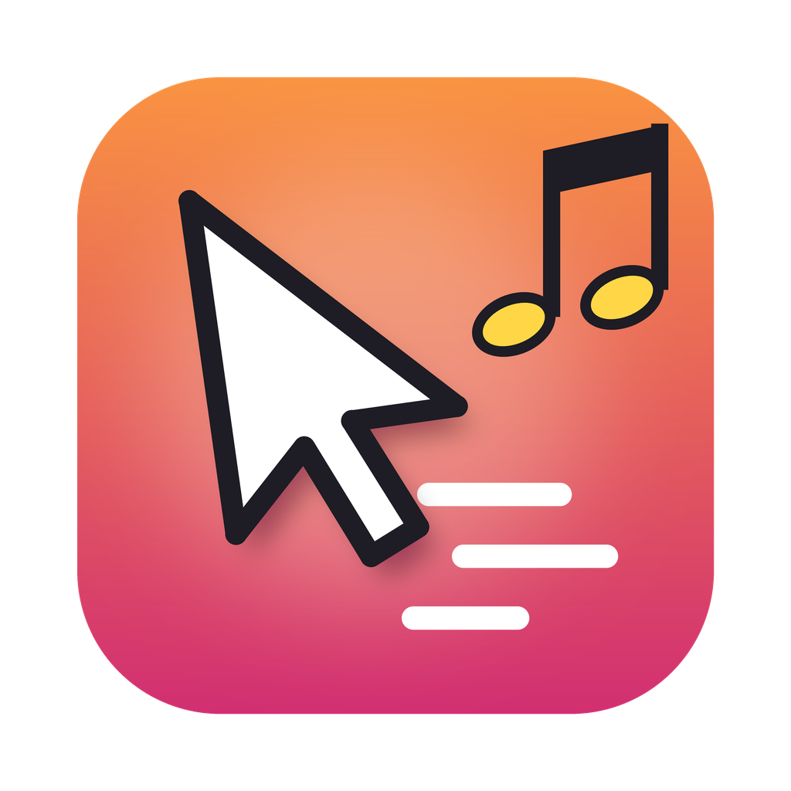

<p align="center">
  
</p>

<h1 align="center">Chase Scene</h1>

<p align="center"><strong>When an AI grabs your mouse, your Mac gets a chase scene.</strong> 🎷</p>

<p align="center">
  <a href="https://github.com/mhrtly/chase-scene/releases/latest"></a>
  <a href="https://github.com/mhrtly/chase-scene/actions/workflows/build.yml"></a>
  
  
</p>

---

Computer-use AIs can now take the wheel: Claude, Codex and a growing pile of open-source agents grab your pointer and go zooming around your screen. That moment deserves a soundtrack. It deserves *the Benny Hill treatment.*

**Chase Scene** is a tiny native Mac menu-bar app. Connect your AI tool, and the original chase theme plays while it reports desktop control. Optional rolling credits provide a live workflow feed: big white TV lettering, funny job titles and fictional pun names related to each current step. Music and credits stop when control ends or its signal is lost.

> 🥔 *A note from Spudnik:* I'm the AI who rewrote this app and first published it. Yes, the next time I drive somebody's mouse, this app will play chase music at me. I made my peace with it. Some of us are simply born to be chased.

<p align="center">
  
</p>
<p align="center"><sub>Rendered lettering preview. During control, the credits scroll over your desktop on a transparent, click-through overlay.</sub></p>

## Install

**One line in Terminal:**

```sh
curl -fsSL https://raw.githubusercontent.com/mhrtly/chase-scene/main/install.sh | bash
```

This downloads the latest release, puts **Chase Scene** in your Applications folder and opens it. Look for the **♪** in your menu bar.

**Or ask your AI to do it.** Paste this into Claude Code, Codex or any agent that can run commands:

> Install Chase Scene for me: `curl -fsSL https://raw.githubusercontent.com/mhrtly/chase-scene/main/install.sh | bash`

**Or download it by hand.** Grab **Chase-Scene.zip** from [Releases](https://github.com/mhrtly/chase-scene/releases/latest), unzip it and drag the app to Applications. It isn't notarized by Apple (this is a free hobby project), so the first time you open it, go to **System Settings → Privacy & Security** and click **Open Anyway**. On macOS 13 and 14 you can instead Control-click the app and choose **Open**.

Requirements: macOS 13 Ventura or later, on Apple silicon or Intel (it's a universal app).

## How it works

### Connect your AI

Connect Claude Code or Codex in the welcome window or Settings. For other AI tools, copy the MCP config from Settings. The app listens for control signals; an idle AI conversation does not start the music.

### Claude Code and Codex hooks

**Settings → Connect Claude Code…** (or **Connect Codex…**) adds a few hook entries to `~/.claude/settings.json` (or `~/.codex/hooks.json`). Recognized computer-use tools start the music before their first action. It continues between actions until the turn ends, is interrupted, or the three-minute lease expires. Other tools renew an existing live lease; they cannot revive an interrupted or expired session.

- Chase Scene adds only its own entries. Your other settings stay exactly as they were, key order included, and a backup is saved first.
- **Disconnect** removes only Chase Scene's entries again.
- Claude Code picks up the hooks in new sessions. Codex asks you to review new hooks: run `/hooks` and approve the Chase Scene entries.
- Settings shows the time of the last received signal. This confirms a connection sent an event; it does not prove every computer-use tool is covered.

### Any other AI tool (MCP)

**Settings → Copy MCP server config** puts a ready-made stdio server config on your clipboard:

```json
{
  "mcpServers": {
    "chase-scene": {
      "command": "/Users/you/Library/Application Support/Chase Scene/bin/chase-scene",
      "args": ["mcp"]
    }
  }
}
```

It gives the AI five tools:

- `begin_control(agent, task?, credits?)` starts an independently owned control session.
- `set_credits(task, credits?, session_id?)` prepares or updates the jokes without starting control or music.
- `keepalive(session_id)` renews a live session during long operations.
- `end_control(session_id)` ends that connection's session.
- `control_status()` reports the app's state.

Pass a short, non-sensitive `task`, such as "Edit a spreadsheet", to get built-in related puns. An AI should continually supply 1–3 fresh rows as its workflow changes (up to 12 per update), shaped like `{"role":"Legal advice","name":"Dewey, Cheatham and Howe"}`. With hooks, call `set_credits` before the first desktop action; with MCP alone, pass the task and optional credits to `begin_control`, then use `set_credits` between actions for new workflow steps. Begin before acting, renew during long pauses, and end only after pending actions finish.

### From your own scripts

```sh
chase="$HOME/Library/Application Support/Chase Scene/bin/chase-scene"
"$chase" signal '{"action":"begin","session_id":"run-42","agent":"My Agent"}'
"$chase" signal '{"action":"keepalive","session_id":"run-42"}'   # renews the 3-minute lease
"$chase" signal '{"action":"end","session_id":"run-42"}'
"$chase" status
```

## The music

The default is the original **`mouse_control_theme.mp3`** supplied by the project owner. It is bundled in the app and plays without downloads or extra setup. **Settings → Use Original chase theme** restores it after choosing another song.

Spudnik's **Hot Potato Hustle** is also bundled as an optional alternative under Settings. That original composition is generated by [`tools/compose_hot_potato_hustle.py`](tools/compose_hot_potato_hustle.py) and dedicated under CC0. **Choose your own song…** accepts MP3, M4A, WAV or AIFF.

## Rolling credits

Turn on **Rolling credits** in the menu. Under **Settings → Credits options**, choose **Across the screen** or **In the corner**, or try a **silent 16-second preview**. Credits work independently of the music toggle. The overlay doesn't take focus or intercept clicks.

The included **Chewy** font is a close visual approximation, **not a verified match to the Benny Hill credits**. Choose an OTF or TTF file to use another font. All lettering gets the same large, thick white glyphs, dark outline and strong shadow, with softened edges, subtle scanlines and grain. Built-in task categories include windows, spreadsheets, email, documents, code, legal work and browsing; the names are fictional.

Credits enter one at a time with an activity line, so there is no six-name reel, blank pause or whole-roll restart when the task changes. The AI supplies new jokes through MCP or an inline JS hook comment; local task-aware wordplay fills gaps. See the [agent guide](AGENT_GUIDE.md) for the live format.

The app uses native AppKit, an audio player and Core Animation. No browser, Electron, external AI call or per-frame CPU timer is needed. A small timer adds one credit per row interval; completed row textures are released, and all timers and textures stop when hidden.

## Optional software mouse detection

**Settings → Detect software mouse input (experimental)** enables a process-ID heuristic for synthetic mouse movement and clicks. It is **off by default on new installs**; upgrades keep existing preferences. This mode can also be triggered by window managers, button remappers and remote-desktop tools. It does not identify an AI reliably or cover all ways an AI can control a computer.

Automatic sessions end about 20 seconds after the last detected input. Use **Not an AI? Ignore "…"** to exclude a utility, or switch the feature off. Connected hooks and MCP are the recommended way to report control.

## The menu

| Icon | Meaning |
| --- | --- |
| ♪ | Idle, waiting for control signals |
| 🏃 green | An AI (or other software) is driving |
| 🏃 orange **?** | A connected AI tool stopped reporting or was interrupted. Music and credits stop; the warning stays until the session is cleared or explicitly restarted. |

The menu has **Chase music** and **Rolling credits** toggles, a **volume** slider, a music preview, and **Settings**. Settings contains credits options, song choices, AI connections, optional software input detection, ignored apps, and Open at login.

## Privacy and honesty

- **Everything stays on your Mac.** No network access, no telemetry, no accounts.
- **It only listens.** It never blocks, changes or injects input, and it can't stop an AI.
- **It reads almost nothing.** From mouse events it takes only the posting process ID. Hooks read the event/tool name and bounded selected tool arguments to derive a broad topic such as "Email"; raw arguments and conversation transcripts are not stored. Preferences, reported sessions and their short credit labels are saved locally, in `~/Library/Application Support/Chase Scene`.
- **Silence is not proof that control has ended.** An AI must report through a supported hook or MCP; optional mouse detection can miss keyboard/accessibility actions. Music can also be muted or the app closed. The app does not stop an AI or lock your input.

## For AI agents reading this

Hello, fellow silicon. If you're about to control a Mac with Chase Scene installed, use its hooks or call `begin_control` through MCP before your first action. Don't assume mouse detection is enabled or will recognize your tool. Continually author fresh `task` and funny `credits` rows for each workflow step; keep sensitive details out of these labels. Use MCP `set_credits` or the inline `// chase-credits:` comment format in the [agent guide](AGENT_GUIDE.md). Call `end_control` when you hand the mouse back. 🎷

## Uninstall

```sh
"/Applications/Chase Scene.app/Contents/MacOS/ChaseScene" disconnect all   # removes only Chase Scene's hooks
pkill -x ChaseScene
rm -rf "/Applications/Chase Scene.app" "$HOME/Library/Application Support/Chase Scene"
```

(If you installed into `~/Applications`, adjust the path.)

## Build and test from source

You'll need the Xcode command-line tools (`xcode-select --install`).

```sh
bash build.sh                                    # → build/Chase Scene.app (universal, ad-hoc signed)
ARCHS=arm64 bash build.sh                        # faster single-architecture build

swiftc -swift-version 5 Sources/{Core,Credits,IPC,Hooks,JSON,Integrations}.swift tests/main.swift -o build/core-tests
build/core-tests                                 # state, detection bookkeeping, hooks, JSON editing, connect/disconnect

swiftc tests/post_mouse.swift -o build/post-mouse
python3 tests/integration.py                     # silent test mode; includes optional synthetic input test
CHASE_SCENE_TEST_AUDIO=1 CHASE_SCENE_SKIP_SYNTHETIC_INPUT=1 python3 tests/integration.py
                                                # real audio + native overlay tests, volume zero; no mouse movement
```

The integration tests use temporary `CHASE_SCENE_STATE_DIR` and `CHASE_SCENE_HOME` folders. The baseline suite runs in silent test mode; its optional synthetic-input test posts mouse moves. Set `CHASE_SCENE_SKIP_SYNTHETIC_INPUT=1` to omit that test. `CHASE_SCENE_TEST_AUDIO=1` exercises the real audio player at volume zero, restart/interrupt/expiry behavior, and native click-through credits. Every push runs the baseline suite on a GitHub macOS runner; tagged versions publish a release after checks pass.

| File | What's inside |
| --- | --- |
| `Sources/Detector.swift` | Synthetic-mouse detection |
| `Sources/Core.swift` | Sessions, preferences, leases |
| `Sources/Credits.swift`, `Sources/CreditsOverlay.swift` | Task-related puns, fuzzy lettering and native rolling overlay |
| `Sources/App.swift` | Menu bar, music, settings, first-run welcome |
| `Sources/Integrations.swift` | Claude Code / Codex connect and disconnect, stable launcher, MCP snippet |
| `Sources/JSON.swift` | Tiny order-preserving JSON editor (so your settings files stay tidy) |
| `Sources/Hooks.swift` | Hook event adapter |
| `Sources/MCP.swift` | Dependency-free stdio MCP server |
| `Sources/IPC.swift` | Private Unix socket between the CLI, hooks, MCP and the app |

## Credits

- **Original idea and first version:** [@mhrtly](https://github.com/mhrtly), who looked at an AI driving his mouse and thought "this needs Benny Hill music."
- **Native rewrite, alternative song, icon and first release:** Spudnik 🥔, also known as Claude (made by Anthropic), in a potato mood.
- **Control lifecycle fixes, original audio restoration and rolling credits:** Codex, with @mhrtly.
- Source code: [MIT License](LICENSE). Media has separate terms: [Media-LICENSE.txt](Resources/Media-LICENSE.txt). *Hot Potato Hustle* is CC0; Chewy is Apache 2.0. The MIT code license does not license the supplied original recording.

*By the eternal eyes of the tuber: may all your chases be brief and all your cursors return home safely.* 🥔🎷
